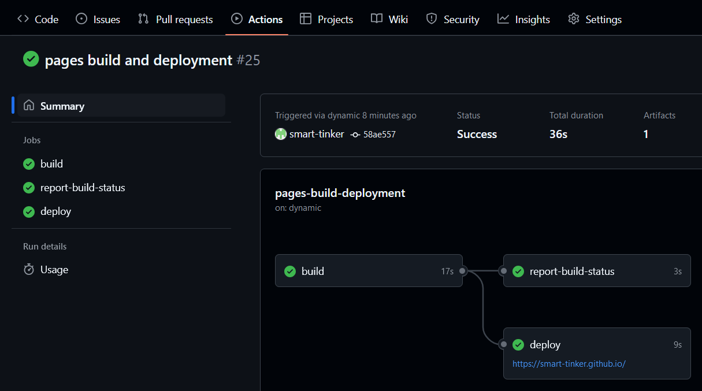

Стартуем цикл постов для организации собственной лаборатории.

Шаг первый - свой сайт. про GitHub Pages.

С одной стороны, персональные сайты проиграли борьбу за внимание социальным сетям. Но с другой стороны - это по прежнему хорошая практика консолидации собственных мыслей и создания личного архива.

Есть невероятное, просто огромное количество мануалов как поднять свой сайт. Drupal, Wordpress, хостинг, VPS и т.д. все мы проходили это. Но зачем усложнять, если можно обойтись простым и элегантным решением? Я расскажу про способ для ленивых ИТшников (какими они и должны быть), которые ценят своё время. Будем поднимать сайт на github pages.

Бесплатно. Есть свой движок Jekyll, за которым не надо следить, который автоматически обрабатывает билды, интегрировано с github (что как бы очевидно). Надо только кинуть пару конфигов и...само наполнение постов в формате markdown. Просто. Быстро. Бесплатно.


Как сделать:  
Создайте репозиторий для GitHub Pages

1. Зайдите в свой GitHub-аккаунт.  
Создайте новый репозиторий, с именем username.github.io (замените username на своё имя пользователя GitHub).  
Важно: Репозиторий должен быть публичным.

2. Активируйте GitHub Pages  
    Перейдите в Settings вашего репозитория.  
    Прокрутите вниз до раздела Pages.  
    Выберите ветку для публикации:  
        Если репозиторий пустой, выберите main и папку /root.  
        Нажмите Save.  
    Сайт будет доступен по адресу: https://username.github.io.

3. Добавьте шаблон Jekyll  
    Зайдите в репозиторий на GitHub.  
    Нажмите Add file → Create new file.  
    Создайте файл _config.yml (это файл настроек Jekyll).  
    Вставьте в него базовые настройки, например:  

    ```
    title: "Мой блог"
    description: "Блог на GitHub Pages с Jekyll"
    theme: minima
    ```

    Тема minima — встроенный шаблон Jekyll, который автоматически поддерживается GitHub Pages. Конкретно для этой темы нужен файл README.md в корне репозитория.

4.   Создайте папку _posts:  
    Нажмите Add file → Create new file.  
    Укажите имя файла, например: _posts/2024-11-21-привет-мир.md.

5. Добавьте первый пост  
    В файле _posts/2024-11-21-привет-мир.md вставьте текст в формате Markdown:  

    ```
    ---
    layout: post
    title: "Привет, мир!"
    date: 2024-11-21 12:00:00 +0300
    categories: блог
    ---
    Добро пожаловать в мой блог на GitHub Pages! Здесь я буду делиться своими мыслями.
    ```

    Нажмите Commit changes, чтобы сохранить файл.

6. Идём в Github actions и ждём как пройдёт билд и деплой сайта.  


7. Проверьте сайт  
    Через несколько минут сайт станет доступен по адресу https://username.github.io. Вы увидите блог с вашим первым постом.