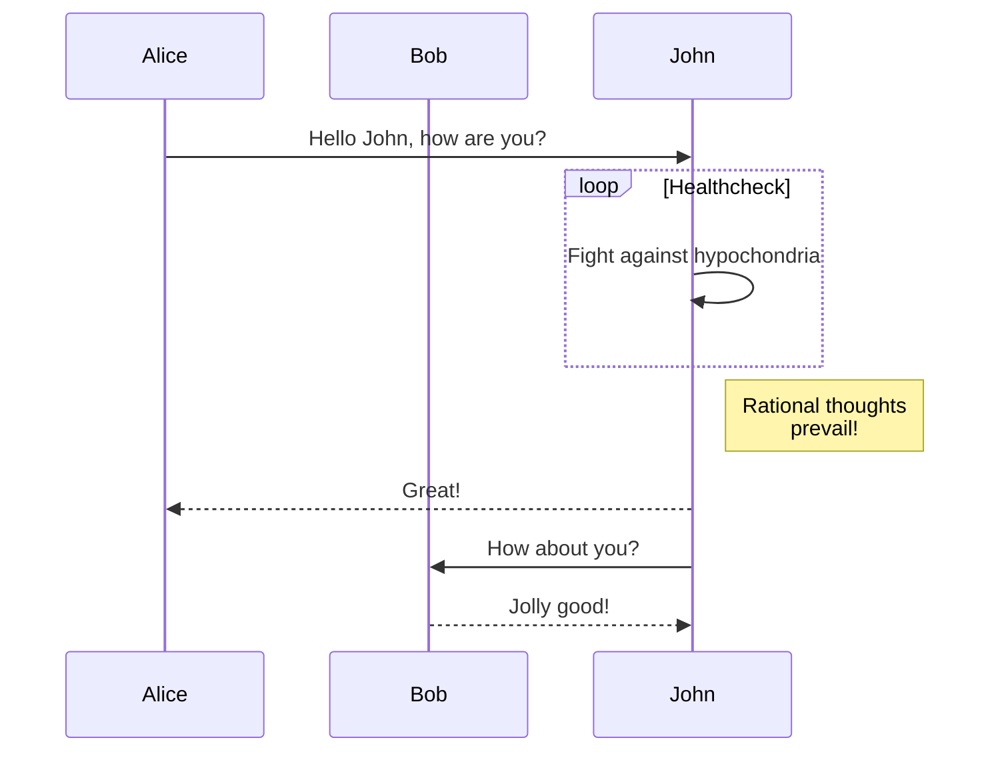
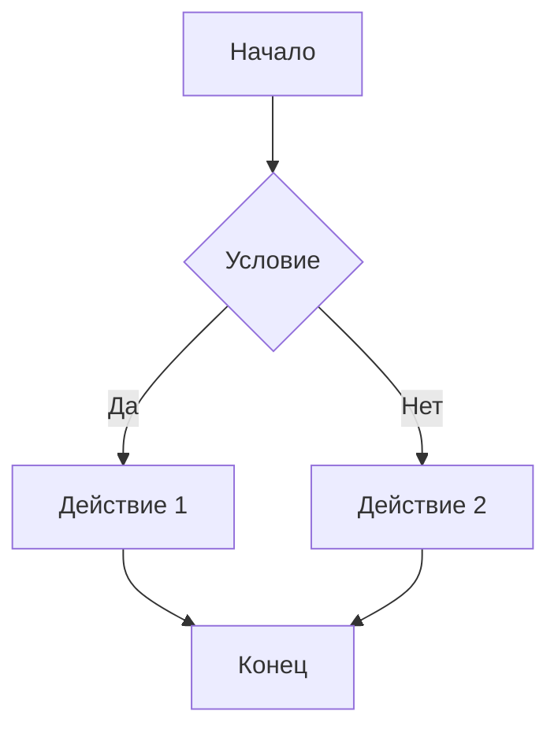

# Тестирование Mermaid диаграмм

Пост должен был быть про диаграммы, но на самом деле он про Windsurf Editor.
По умолчанию Github Pages не показывает диаграммыв формате Mermaid.
Поэтому я как раз решил попробовать работу нового AI редактора кода.

Просто попросил его добавить такую функциональность в мой блог на github и...барабанная дробь...он всё сделал.
Я по прежнему не разбираюсь в программировании, поэтому для меня это отличный вариант решения.

Ну и да, ниже дефолтный текст, который AI подсунул для примера.

Ниже представлена простая диаграмма последовательности:

Вы также можете создавать другие типы диаграмм, например, блок-схемы:

