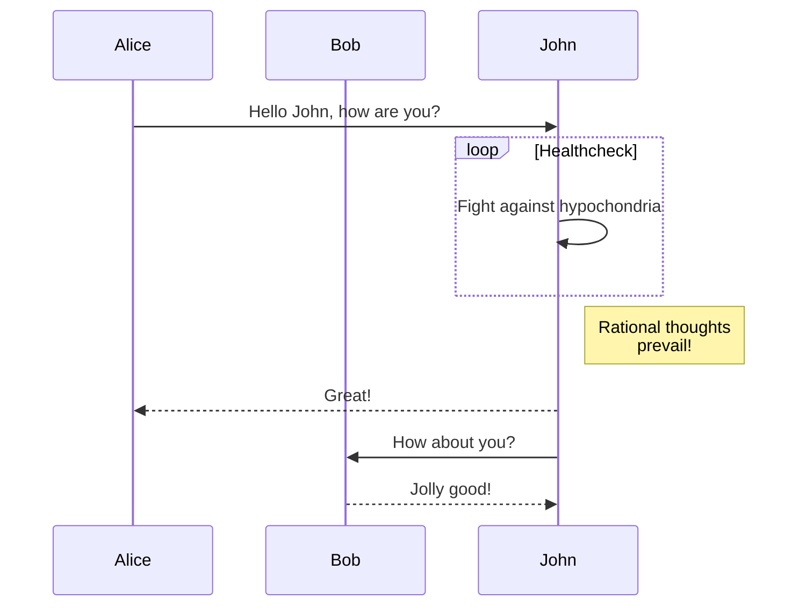
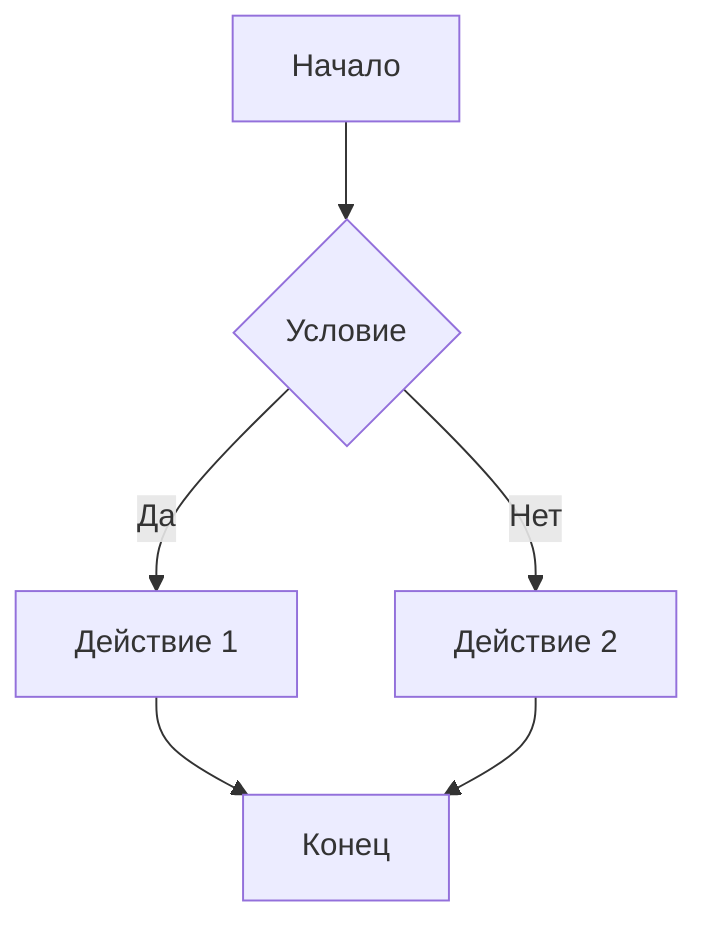

# Тестирование Mermaid диаграмм

Ниже представлена простая диаграмма последовательности:

```mermaid
sequenceDiagram
    participant Alice
    participant Bob
    Alice->>John: Hello John, how are you?
    loop Healthcheck
        John->>John: Fight against hypochondria
    end
    Note right of John: Rational thoughts <br/>prevail!
    John-->>Alice: Great!
    John->>Bob: How about you?
    Bob-->>John: Jolly good!
```

Вы также можете создавать другие типы диаграмм, например, блок-схемы:

```mermaid
graph TD
    A[Начало] --> B{Условие}
    B -- Да --> C[Действие 1]
    B -- Нет --> D[Действие 2]
    C --> E[Конец]
    D --> E
```
