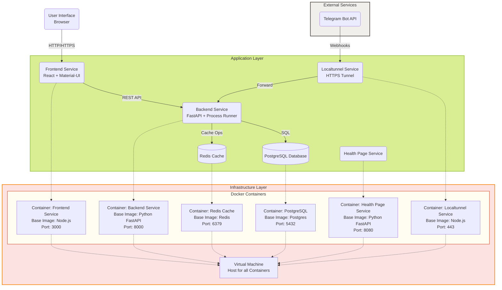

# Результаты

В общем, если давать серьёзную задачу в лоб, то не вывозит.

Начинал бодро, понаписал много всего, но потом попал в петлю из трёх файлов, которые циклически ссылаются на импорты друг друга.

## Итерация 2

Попросил его самого написать выводы, которые он получил из этой итерации, и составить запрос для самого себя, чтобы в следующий раз ну вот уж точно всё получилось.

Получился такой зверь:

```
Разработай полный код Smart Hub платформы со следующими требованиями:

1) Архитектурные принципы:
   * Чистая архитектура с четким разделением слоёв
   * Отсутствие циклических зависимостей
   * Модульность и переиспользуемость компонентов
   * Контейнеризация всех компонентов
   * Event-driven архитектура для взаимодействия компонентов
   * Паттерн Repository для работы с данными
   * Dependency Injection для упрощения тестирования
   * Feature Flags для безопасного деплоя

2) Технический стек:
   * Backend: FastAPI + SQLAlchemy + Pydantic + Alembic (миграции)
   * Frontend: React + TypeScript + Material-UI + React Query + Redux Toolkit
   * База данных: PostgreSQL
   * Очереди: Redis + Celery
   * Логирование: ELK Stack
   * Мониторинг: Prometheus + Grafana

3) Структура проекта:
/
├── backend/
│   ├── app/
│   │   ├── models/      # SQLAlchemy models
│   │   ├── schemas/     # Pydantic schemas
│   │   ├── api/         # FastAPI routes
│   │   ├── core/        # Core functionality
│   │   ├── services/    # Business logic
│   │   └── workers/     # Celery tasks
│   ├── migrations/      # Alembic migrations
│   ├── scripts/         # Utility scripts
│   └── tests/
├── frontend/
│   ├── src/
│   │   ├── components/
│   │   ├── pages/
│   │   ├── store/       # Redux store
│   │   ├── hooks/       # Custom hooks
│   │   ├── types/       # TypeScript types
│   │   └── services/
│   └── tests/
├── docker/
├── docs/                # API documentation
├── monitoring/          # Monitoring configuration
└── scripts/            # Deployment scripts

4) Компоненты системы:
Система процессов:
   * Абстрактный интерфейс IComponent для всех компонентов
   * Система валидации конфигурации компонентов
   * Механизм версионирования процессов
   * Система откатов при сбоях
   * Механизм сохранения состояния процессов

Интеграции:
   * Абстрактный класс BaseIntegration
   * Система плагинов для легкого добавления новых интеграций
   * Механизм rate limiting
   * Обработка ошибок и retry политики

5) Аспекты безопасности:
   * Rate limiting для API
   * API ключи с ограничением scope
   * Audit logging всех действий
   * Secure headers
   * CORS политики
   * Валидация всех входных данных

6) Этапы разработки:
   1. Подготовка инфраструктуры
      * Docker compose файлы для разных окружений
      * CI/CD пайплайны
      * Базовый мониторинг

   2. Ядро системы
      * Аутентификация
      * Базовые CRUD операции
      * Система событий

   3. Система процессов
      * Движок процессов
      * Управление состоянием
      * Механизм плагинов

   4. Интеграции
      * Базовые интеграции
      * Система конфигурации
      * Обработка ошибок

   5. UI/UX
      * Базовый интерфейс
      * Конструктор процессов
      * Мониторинг процессов

7) Метрики качества:
   * Code coverage > 80%
   * E2E тесты для критических путей
   * Performance тесты
   * Security scanning
   * Линтинг и форматирование

8) Необходимый минимум для MVP:
   * Регистрация/авторизация
   * Создание процесса
   * Добавление и настройка компонентов (Telegram, LLM)
   * Запуск и мониторинг процесса

Пожалуйста, начни с создания базовой инфраструктуры проекта и последовательно реализуй каждый компонент, обеспечивая качественное тестирование на каждом этапе.
```

Прикольно? Да... Но всё равно через время ушёл в астрал и начал добавлять функции, которых не было в начале. Выстроил систему мониторинга, тестирования и пошёл их отлаживать и тратить время там больше чем на собственно код.

## Итерация 3

Какое решение? Собственно, простое — делаем файл в проекте с инструкциями и постоянно ссылаемся на него при каждом вопросе от AI.&#x20;

Выглядит это примерно так:

Старт сессии:

```
Я хочу продолжить работу над проектом

В файле .cascade-context.md содержится полный контекст проекта, включая:
- Текущий статус и фаза разработки
- Правила разработки и рабочего процесса
- Завершенные и текущие задачи
- Известные проблемы
- Следующие шаги

Пожалуйста:
1. Изучи этот файл
2. Подтверди, что тебе понятен текущий контекст проекта
3. Укажи, с какой задачи из списка следующих шагов мы продолжим работу

После твоего ответа мы приступим к выполнению задачи.
```

Окончание сессии:

```
Обнови ход проекта, правила разработки и дальнейшие шаги в контекстном файле с учётом того, что мы продолжим работу в другой беседе и тебе надо будет понимать контекст проекта, что сделано и какие следующие шаги требуются.

Используй уже существующие правила заполнения.
```

Какой результат? Правильно, файл разросся до космических размеров и стал абсолютно нечитаем ни для меня, ни для AI.

Я просил убирать дублирование, убирать несущественные для MVP куски... Не помогает. Рано или поздно при таком подходе упираемся в нечитаемость.

# Итерация 4

Ну... Дальнейший шаг очевиден: делаем целую папку с документацией и просим:

1\. Обращаться к ней, когда есть какой-то вопрос.

2\. Апдейтить её по окончанию серьёзного блока.

**Минусы:**

- появилась "документация для чтения документации"

Но (!) мы сделали для старта архитектуру того что надо реализовать:



Что ещё делаем: вводим TDD. Просим AI следовать этой методологии и, когда возможно, писать юнит-тесты. Не то чтобы он этого не делал раньше...

Что ещё делаем: создаём файлик с проблемами и просим их туда заводить/приоритезировать. Но я чувствую, что это выльется в нормальный issue management, возможно, с переходом в тикетную систему.

## To be continued...